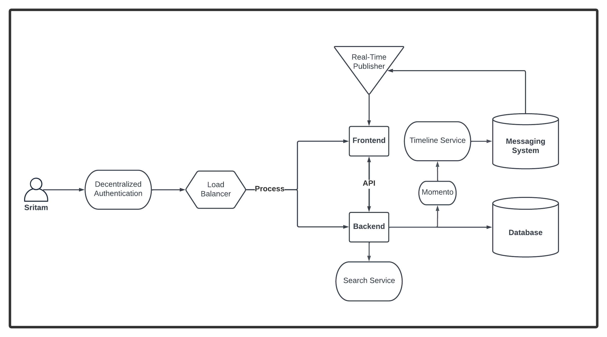
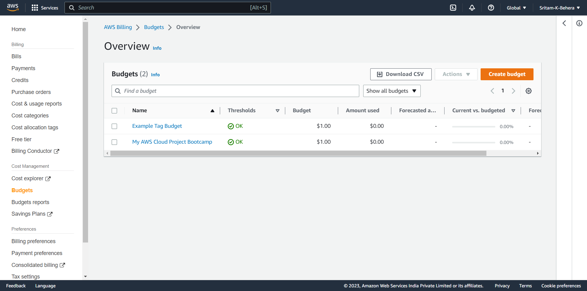
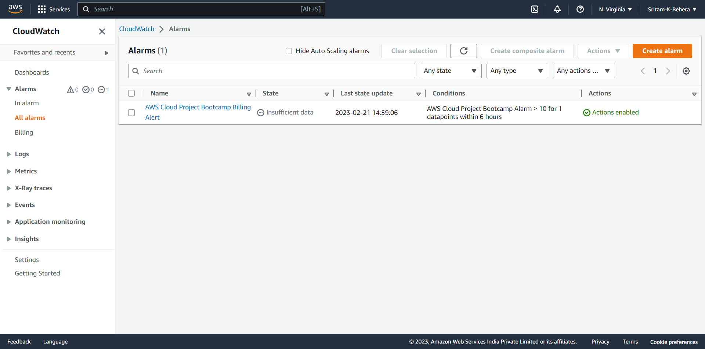
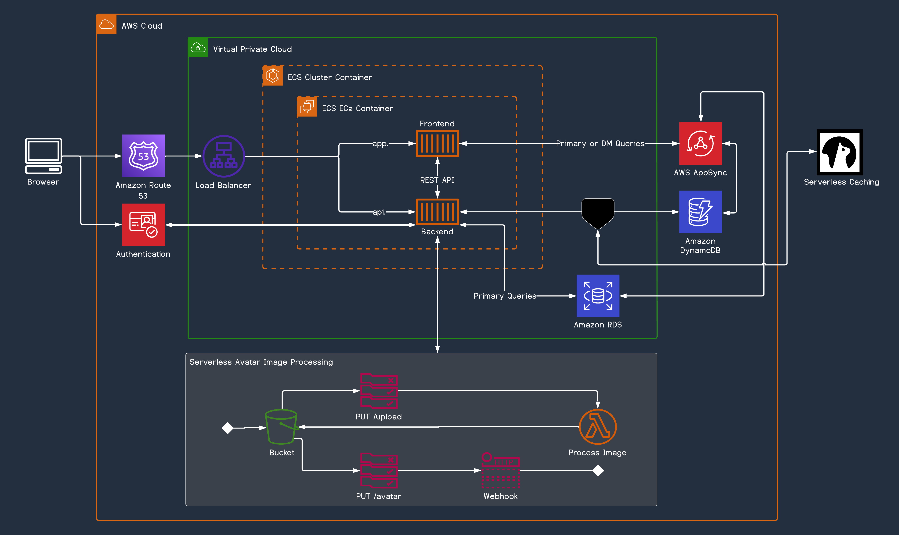
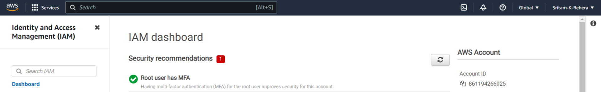

# Week 0 — Billing and Architecture

## Required tasks

### Recreating a Conceptual Diagram
I used lucidcharts to draw a basic conceptual diagram using different shapes & sizes to visualize the Cruddur.

#### View link for the [Cruddur Conceptual Diagram](https://lucid.app/lucidchart/bf92d43f-17a8-4d37-9f9e-97734d0d088f/edit?view_items=~r4y4od50UpA&invitationId=inv_1dd5b81f-4427-47b1-bb4b-39aeca524e0a)

### Creating a Budget
Here i got to know about the importance of a budget, it's availibility in free tier & how to create it. i used both CLI & AWS console to create two of these following the instructions in both spend consideration & one of the extra videos & after going through this i also made sure cut out some of my sensitive information.

### Creating a Billing Alarm
In this task, i created a billing alarm from both the CLI & AWS Console by following the instructions provided by the respected instructor in one of the extra classes videos in the week 0.

### Using AWS CloudShell
Also in the above mentioned add on videos i got to know how to use cloudshell which is one of the many ways to access AWS services.

### Generating AWS Credentials & installing CLI
In the later steps, i generated credentials & installed CLI on to Gitpod for ease of access by following the instructions in week-1-again branch of instructors' project repo. 

### Recreating a Logical Diagram
This time i used lucidcharts to a much greater extent & build a whole logical diagram from scratch. Using the AWS service icon pack & uploading the momento icon was a whole experience in it's itself.

#### View link for the [Cruddur Logical Diagram](https://lucid.app/lucidchart/843155a3-44a5-4765-b7eb-1d6dba836044/edit?viewport_loc=-726%2C162%2C2999%2C1464%2C0_0&invitationId=inv_63f7292b-9587-43c3-92fd-d1d74894024b)

## Homework Challenges

### Destroy your root account credentials, Set MFA, IAM role
i followed the best practice & set up multi factor authentication in both of my accounts after i added an admin. 

### Open a support ticket and request a service limit
I wanted to do this but upon some googling, i got to know that support is not very much available for free-tier accounts which totally makes sense.